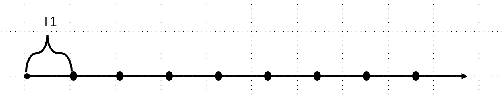
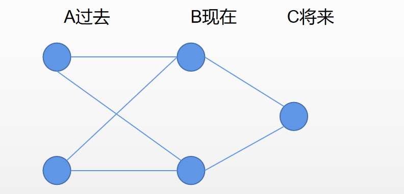

研究生有兴趣结合深度学习和随机过程进行理论上的学习和探索。

博学之审问之慎思之明辨之笃行之

# 1. 高斯过程

随机过程教学内容大致可以分成两类：

1. **随机过程一般性的描述**：即并不着眼于某一类特殊的过程，而是着眼于研究随机过程一般意义上的方法。随机过程是研究随机变量之间的相互关联：线性、马尔可夫、鞅。

   > 线性关联研究的主要工具是**相关函数**，相关函数可以从时域频域两个角度认识，在时域上是相关函数，在频域上是功率谱密度。相关函数考察的是：随机过程在两个时刻的取值得到的随机变量之间的相互关联，即这两个随机变量之间在多大程度上可以被相互地线性表出。由这个概念，我们还引出了宽平稳，非宽平稳。

2. **涉及到某类具体的随机过程**

   > 高斯过程和泊松过程在整个随机过程中占据着核心地位。这两个随机过程是我们迄今为止，认识得最清楚的最深刻两类随机过程。他们的理论最为自洽和优美，应用最为广泛。

高斯在密度当中有表达两个随机变量关联的因素存在，这个因素恰好是**相关运算**。这表明高斯分布，特别是多元高斯分布，他与相关线性表出等等知识是有着内在联系的。

而高斯过程就是用N维高斯分布来进行定义的。所以我们把N维高斯分布作为学习高斯过程的核心内容。
$$
f_X(x)=\frac{1}{(2\pi)^{\frac{n}{2}}(det\Sigma)^{\frac{1}{2}}}exp(-\frac{1}{2}(x-\mu)^T\Sigma^{-1}(x-\mu))
$$
从知识体系的延伸来说，当我们进入一个新的知识领域的时候，我们会不可避免地问自己一个问题，就是研究这个问题的motivation是什么？——高斯分布有何奇特之处？以下将从三个不同的方面来说明：为什么高斯分布生来就是做概率统计的老大。

## 1. Motivation

### 1. 中心极限定理

再说中心极限定理之前，先说一说大数定律：

#### 大数定律：

$$
\frac{X_1+X_2+···+X_N}{N}=E(X_1) \quad X_i \sim \ i.i.d
$$

这个极限起到的作用就是把$X_i$的随机性通过叠加（想象正负相交有这么一种感觉）把随机起伏的效应涨落全部都通过平均消除掉，把确定性的部分能够浮出水面。而这确定性的部分恰好就是期望。

#### 中心极限定理：

$$
\frac{X_1+X_2+···+X_N}{\sqrt{N}}\sim N(0,1)\quad E(X_i)=0,Var(X_i)=1
$$

中心极限并没有把它的随机性全部消除掉，而是留下了一些公共部分，即这些随机变量都拥有的、非常能够反应随机本质的部分。这是一个随机性规律非常确定的随机变量：就是高斯。

> 由此可见，高斯在随机变量之间起着一个核心的作用，因为各个随机变量之间都多多少少含有高斯的成分，当你约束了之后，高斯的成分就凸显出来了。

#### 证明：特征函数

$$
\Phi_{X}(w)=\int_{R}f_X(x)exp(jwx)dx=F^{-1}(f_X(x))
$$

特征函数是概率密度的傅里叶反变换，$指数里面-jwx$是傅里叶变换，特征函数是作为随机变量的特征性质出现的，每一个随机变量都有自己的概率密度，而特征函数与概率密度之间是傅里叶变换对，1:1的。

特征函数最重要的性质是**可加性**：
$$
Y=X_1+···+X_n \quad X_i \sim independent \\ 
\Phi_Y(w)=\prod_{k=1}^n\Phi_{X_K}(w)
$$
随机变量的和，原本是会让随机性增强（方差变大），让复杂度增加。但是有了特征函数，处理起来就得心应手。

 

我们研究概率论，一半以上的工作是在做积分，因为我们总得求和，概率最重要的特性就在于他是可加的，即概率最重要的理念，就在于他认为不确定度是可以加在一起的，我们算的所有的概率理论上都是在做加法，即积分。

> 中心极限定理告诉我们：大量微小的随机因素叠加在一块的时候，呈现的整体的统计效应是高斯。因此，高斯无处不在。噪声为什么经常假设为高斯？电子设备的热噪声很多是来自“霰弹效应”，阴极射线板之间有很多电子挣脱束缚，在电场的作用下运动，从一个射线板到达另外一个射线板，会有一个冲击。这个冲击作为一个电子而言效应非常微小。但是有大量这样的冲击，叠加在一起，总体的效应就很可观。你很难仔细地去研究这个冲击本身特性是什么，不过已经不必要了，原因在于大量的冲击叠加在一起，总体的效应一定是高斯。

### 2. 分子运动

 

### 3. 最大熵原理

高斯是最随机的随机变量，因为它又最大熵，随机性最强，最具典型意义。最值得研究，最好研究，最有解析解。

 

以上我们从不同的角度认识了我们为什么要学高斯，motivation非常的重要。为什么中国人民志愿军能够在那么艰苦的条件下，能够在武器存在代差的条件下可以和当时世界上最强的军队打成平手，就是因为我们解决了为什么要打仗的问题，我们的士气，我们的意志力是绝对超过美军的。这绝对是当时世界上最强的轻武兵，没有之一，就因为我们解决了为什么打仗的问题。

---

现在我们回到多元高斯分布：
$$
f_X(x)=\frac{1}{(2\pi)^{\frac{n}{2}}(det\Sigma)^{\frac{1}{2}}}exp(-\frac{1}{2}(x-\mu)^T\Sigma^{-1}(x-\mu))
$$
首先我们来检查一下这的确是一个概率密度。我们在检查这样一个显然是事实的过程中，我们可以体会在多元高斯的学习过程中，我们需要去经理哪些困难，以及我们需要去掌握的哪些手段。

 

我们再来看特征函数从一维延伸到多维：

1. 多元高斯的线性不变性：

   

2. 边缘分布仍然是高斯的：

直观的想象：多元高斯已经是一个钟型了。从联合分布求边缘分布不是在切，而是在挤。钟型挤成一片还是钟型。但是反过来就不一定了。挤出来是个钟型，还原回去还真不一定就是钟型。

##  2. 联合高斯

对于一组随机变量，我们是否有办法能够判断它的联合高斯性？有没有一种办法，它不仅仅是看每一个分量，他的看法应当是更加的宏观，且更加的有控制力。利用这样的方法。我们能够去判断联合高斯性：

### 1. 判断多元高斯的充要条件

$$
X\in R^n\quad X\sim N \ \Leftrightarrow \forall \alpha\in R^n\quad\alpha^TX\sim N
$$

这是我们联合高斯的特征性质。X的分量之间的任意的线性组合都是高斯的。

 

### 2. 相关性和独立性

不相关不等于独立，这说明两个随机变量的关系已经有点远了，在两阶上已经是没有关系了。但是它并不是独立的，因为他们可能存在更高阶的关联。用二阶矩没有办法描绘的关联。回到高斯，我们不禁会产生这样的疑问，既然高斯是完全由一阶矩和二阶矩可以确定下来，那么两个高斯的随机变量不相关是否能推得独立呢？不能，得要联合高斯。

对于多元高斯，不相关性和独立性存在这等价关系。
$$
X=(X_1,···,X_n)\sim N \\E(X_iX_j)=E(X_i)E(X_j), \forall i,j \Rightarrow (X_i,···,X_n)\quad Is \ Mutually\ Independent
$$
我们也不是完全不能由边缘推出联合高斯。**条件就是分量之间相互独立。**即独立的情况下，边缘是高斯，联合也是高斯。
$$
(X_i,···,X_n)\quad Is \ Mutually\ Independent\\
X_k\sim N,(k=1,2,···,n) \Rightarrow  X=(X_1,···,X_n)\sim N
$$

### 3. Cochran Theorem

**如果样本是高斯分布，那么样本均值和样本方差就是独立的**

## 3. 条件期望

$$
E(X_1|X_2)=\mu_1+\frac{\sigma_{12}}{\sigma_{22}}(X_2-\mu_2)
$$

条件期望意味着我这时知道了关于X2的信息，这一部分知识，换句话讲，我对于X1而言不是一无所知，至少X2里头和X1相关的这部分信息已经被我把握住了。所以在这种情况下，我对于X1的认识势必要进行一下更改，我的更改要基于我所知道的知识。X1 X2相关性越强，做出的调整就越大。
$$
\Sigma_{1|2}=\Sigma_{11}-\Sigma_{12}\Sigma_{22}^{-1}\Sigma_{21}
$$
方差一定是变小的，因为我们获得了X2关于X1的部分知识，而熵一定是减小的。

而我对于X1和X2的认识是从相关的角度，只在线性的程度上进行认识，但是在这个程度上认识就够了。因为这是高斯，这就是最优，我这个调整是能够做出来的最优的调整。因为他是条件期望。条件期望是均方意义下的最优。

 

### 1. 条件期望是均方意义下的最优

对于高斯分布，它的条件期望是线性的，所以最优线性估计和最有估计是相等的。

 

## 4. 非线性

我们希望研究非线性操作下，高斯具有什么样的性态。

### 1. 多项式

#### 1. 一维高斯的高阶矩：

$E(X^n) = -\frac{1}{\sqrt{2\pi}\sigma}\int_{-\infty}^{+\infty}x^ne^{-\frac{x^2}{2\sigma^2}}$

 

可以看到奇数阶矩留不下来，如果高斯的均值是零。偶数阶矩不管多高的阶数都可以表示成二阶矩。

#### 2. 平方器->卡方分布

$Y(t)=X^2(t)$

#### 3. 平方器相关函数

高斯过程，平方器输出的相关涉及到的相关是自身的四阶矩的计算。
$$
R_Y(t,s)=E(X^2(t)X^2(s))=R_X^2(0)+R_X^2(t-s)+R_X^2(t-s)=R_X^2(0)+2R_X^2(t-s)
$$
搞清楚平方器后，多项式就对我们没有本质性的难度了。剩下的只是一些繁琐的计算。

### 2. 分段线性

#### 1. 硬限幅器->相关函数

 
$$
P(X(t)X(s)\geq 0)=\frac{1}{2}+\frac{1}{\pi}sin^{-1}(\frac{R_X(t-s)}{R_X(0)}) \\
P(X(t)X(s)   < 0)=\frac{1}{2}-\frac{1}{\pi}sin^{-1}(\frac{R_X(t-s)}{R_X(0)}) \\
$$
公式（13）揭示了：随着$\rho$慢慢由0向非零转变，第一象限的概率是如何变化的。

#### 2. 反正弦定理

最终得出相关函数，有个名字叫反正弦定理（Arcsin Law）：
$$
R_Y(t,s) = \frac{2}{\pi}sin^{-1}(\frac{R_X(t-s)}{R_X(0)}) \\
$$
这个结论得出的过程其实不难，因为都是恒等式，恒等式就意味着你要过河的话，那个石头都给你摆好了，只不过因为天有些黑，所以你看不太见，并不等于那儿没有，如果你眼力好，或者打上一个火把，你就蹭蹭蹭过去了，真正难的是前边根本没石头，往前一迈就掉进去了，你得自己弄一块石头往前一拽，走一步，再拿块石头往前一拽，再走一步。这才是难的。

#### 3. Price 定理

$$
(X_1,X_2)\sim N(0,0,\sigma_1^2,\sigma_2^2,\rho)\\
E(g(X_1,X_2))\Rightarrow \frac{\partial E(g(X_1X_2))}{\partial \rho}=(\sigma_1\sigma_2)E(\frac{\partial g^2(X_1X_2)}{\partial X_1\partial X_2})
$$

price定理三部曲：

##### 1. 指示函数

##### 2. ReLU函数

##### 3. 平方器

### 3. 指数函数

##### 1. 对数正态：特征函数

### 4. 三角函数

积分是积不出来的，Price定理看上去也有些艰险：$\frac{d^2}{d\rho^2}z(\rho)=z(\rho)$

但是注意到：因为三角函数和指数函数是一回事，所以特征函数又可以拥用上去了，我们有欧拉公式：
$$
cos\theta=\frac{1}{2}(exp(j\theta)+exp(-j\theta))
$$

### 5. 总结

处理非线性问题，我们一共有三招：

1.积分（一般不要用）   

2.Price定理（一般情况下很好用）   

3.特征函数（指数函数的情况下特别好用）

三角函数和指数函数是一个意思。我们中学给大家打下的烙印不太对，把这两者生生地割裂开，这是因为我们没有强调复平面的核心作用，所以应当先教复数，建立起平面、矢量的概念，把二维平面的矢量与复数能够建立起联系，随后诸如什么三角变换，旋转，平移等等一系列问题都迎刃而解了，你想想旋转不就是乘上一个复因子嘛，到线性代数就是乘上一个矩阵了，事实上，矩阵$\begin{pmatrix} C & -S\\ S & C\end{pmatrix} \sim C + jS$ 是同构。$\begin{pmatrix} C^{(\theta)} & -S^{(\theta)}\\ S^{(\theta)} & C^{(\theta)}\end{pmatrix} \sim e^{j\theta}$

从历史上来看，复数的出现和直角坐标系的出现是同时的。笛卡尔创立直角坐标系，几乎同一年莱布尼兹在考虑-1的开方。

非线性这一部分知识研究的热潮是在五六十年代，当时的电子信息系统，特别是对电路的研究很盛行，电路的核心因素是算噪声特性。通常都把噪声假设为高斯，所以就意味着高斯通过非线后的性态是我们必须要面对的课题。输入是个白噪声，输出是什么谱，要随着噪声在电路里头一级一级的变化，做很多的操作，让这个噪声的性质在他的把控之中。

非线性也就高斯能玩一玩，别的都是瞎掰。

现在的所谓智能主要来自于非线性，卷积层是用一个个pattern去卷这个输入，为什么现在越来越流行用小pattern了，其实刚一开始5x5、7x7的很多人用，为什么现在都落到3x3了？因为用小pattern，这个维度下降的不是那么快，而我们可以有更多的非线性可以介入进来，为什么人们喜欢用更深的网络，其实原因也在于我们要有更多的非线性要接入进来，线性能够产生的故事和产生的现象，太过有限了。只有更多地非线性介入进来之后，我们才能有一个更好地智能的基础。

# 2. 泊松过程

我们研究随机过程，研究随机变量之间的关系，主要有两个：相关关系和马尔可夫关系。

我们做马尔可夫的次序和相关关系的次序是反的。我们做相关关系的时候是先给出一般性的理论的陈述。再举特殊的例子——高斯过程。现在我们先研究特殊的过程，再做一般性的陈述。泊松过程作为最典型的马尔可夫过程是非常深入的。泊松过程可以用比较初等的方法进行研究，但是我们所揭示出来的现象的丰富程度和我们认识的理论的深刻程度却是相当惊人的。

泊松过程虽然并不是很符合实际，但是由泊松过程所衍生出来的子子孙孙确实有着巨大的作用。

**泊松的密度函数：**
$$
P(N(t)=k)=\frac{(\lambda t)^k}{k!}exp(-\lambda t)\\
N(t)\sim P(\lambda t)
$$

## 1. 泊松的四条假设

### **假设1：N(0) = 0**

### **假设2：独立增量**

> 数据包到达的规律、保险：我想设计一个保险无外乎两个问题：1. 这个保险卖多少钱，2.如果出了事，赔多少钱。出不出事，什么时候出事，多大频率出事，一段时间之内出多少事，你说不清，

$\forall \ t_1<t_2\leq t_3<t_4\quad N(t_2)-N(t_1)独立于N(t_4)-N(t_3)$

### **假设3：平稳增量**

$N(t)-N(s)\sim P(t-s)$

### **假设4：稀疏性**

## 2. 矩母函数

我们的主要研究方法为矩母函数（Moment Generating Function）：
$$
\begin{align}
&G_X(z)=E(z^X)=\sum_{k}z^kP(X=k)=\sum_{k}z^kP_k \\
&\Phi_X(w)=E(e^{jwx})=G_X(z)|_{z=e^{jw}}
\end{align}
$$
特征函数是矩母函在复平面单位圆上的取值。[复平面](D:\ALL\Statistic\复平面.md)的概念

**特征函数适合研究连续的随机变量，矩母函数适合研究离散的随机变量。**

为了研究泊松过程，我们试图计算下面这个矩母函数：
$$
\begin{align}
G_{N(t)}(z)
&=E(z^{N(t)})\\
&=\text{exp}(\lambda t(z-1))
\end{align}
$$
这样最后的系数项，见公式（18），就会是我们想要的泊松过程的分布函数

### 1. 差分方程

数学建模的一个常见路数，解微分方程，所以先做差分，构建差分方程，等摸清楚等号右边的性态，再令$\Delta t\to0$，就可以将一个差分方程变为微分方程：
$$
\begin{align}
(G_{N(t+\Delta t)}(z)-G_{N(t)}(z))/\Delta t&=E(z^{N(t+\Delta t)})-E(z^{N(t)})\\
&=E(z^{N(t+\Delta t)}-z^{N(t)})\\
&=E(z^{N(t)}(z^{N(t+\Delta t)-N(t)}-1)) \\
&=E(z^{N(t)})E(z^{N(t+\Delta t)-N(t)}-1))\\
&=G_{N(t)}E(z^{N(\Delta t)}-1)
\end{align}
$$
于是进一步需要摸清楚$E(z^{N(\Delta t)}-1) \ 当\Delta t\to 0时候的性质$
$$
\begin{align}
E(z^{N(\Delta t)}-1) &=\sum_{k}(z^k-1)P(N(\Delta t) = k)\\
&=P(N(\Delta t) = 0) + zP(N(\Delta t) = 1) + \sum_{k\geq 2}z^kP(N(\Delta t) = k)-1\\
\end{align}
$$
我们一项一项解决：

### 2. 指数浮现：

$$
\begin{align}
P(N(t)=0)=&P(N(s)=0,N(t)-N(s)=0)\\
=&P(N(s)=0)P(N(t)-N(s)=0)\\
=&P(N(s)=0)P(N(t-s)=0)\\
\Rightarrow& F(t)=F(s)F(t-s)\\
\Rightarrow& F(t+s)=F(s)F(t)\quad \forall  t,s \geq 0\\
\Rightarrow& F(t)=e^{\lambda t}
\end{align}
$$

#### 证明：

下面我们来证明为上面F(t)一定是指数。

**连续性：极限和函数行为可以交换次序：$\lim\limits_{n\to\infty}F(x_n)=F(\lim\limits_{n\to\infty }x_n)$**
$$
\begin{align}
①&假设F(t)连续：F(t)=\log H(t)\Rightarrow H(t+s)=H(t)+H(s)\Rightarrow H(t)=\lambda t\\
&F(t)=(F(\frac{t}{2}))^2\geq 0；如果F(t)=0,F(t/2)=0...F(t/2^n)=0\Rightarrow F(0)=0\\
&F(t)=F(0)F(t)=0,对任意的t都成立，显然不在我们所讨论的范围，故F(t)>0\\
②& \N \quad H(n)=H(n-1)+H(1)=H(n-2)+2H(1)=···=nH(1)=\lambda n \\
&又由于：H(0)=H(0)+H(0), 所以H(0)=0\\
③& \Z \quad H(-n)+H(n)=H(0)=0 \Rightarrow H(-n)=-H(n)=(-n)H(1)=\lambda(-n)\\
④& \Q\quad H(\frac{1}{n})=\frac{1}{n}H(1)\Rightarrow H(\frac{m}{n})=\frac{m}{n}H(1)=\lambda(\frac{m}{n})\quad\quad\quad\quad\quad\quad\quad\quad\quad\quad\\
⑤&\R\quad x\in \bar \Q ,\ \exists\{q_n\}\subseteq \Q,\  \lim\limits_{n\to\infty}q_n=x\Rightarrow H(x)=H(\lim\limits_{n\to\infty}q_n)=\lim\limits_{n\to\infty}H(q_n)=\lim\limits_{n\to\infty}(\lambda q_n)=\lambda x
\end{align}
$$

$$
P(N(\Delta t)=0)=e(-\lambda \Delta t) \leq 1\quad,\lambda\geq 0
$$

下面我们再来解决后面的项：
$$
P(N(\Delta t) = 1)(z+\sum_{k\geq 2}\frac{P(N(\Delta t)=k)}{P(N(\Delta t)=1)}z^k)
$$

### 3. 稀疏性（Sparsity）解析的解释

$$
\frac{P(N(\Delta t)\geq 2)}{P(N(\Delta t)\geq 1)}\to0\quad,(\Delta t\to0)
$$

**稀疏性：在一段小的时间之内，发生多次事件的概率是发生一次事件概率的高阶无穷小。**

### 4. Z变换

对于矩母函数，收敛域为：$|z|\leq 1$  

$\sum_{k}z^kP_k， z=1概率和为1，还是收敛的。$

所以：
$$
|\sum_{k\geq2}\frac{P(N(\Delta t)=k)}{P(N(\Delta t)=1}z^k|\leq\sum_{k\geq2}|\frac{P(N(\Delta t)=k)}{P(N(\Delta t)=1}|·|z^k|=\frac{P(N(\Delta t)\geq2)}{P(N(\Delta t)=1}\stackrel{\Delta t\to 0}{\longrightarrow}0
$$

最后一项：
$$
\begin{align}
&P(N(\Delta t) = 0)+P(N(\Delta t) = 1)+P(N(\Delta t) \geq2)=1\\
\Rightarrow &P(N(\Delta t) = 1)(1+\frac{P(N(\Delta t)\geq2}{P(N(\Delta t)=1)})=1-P(N(\Delta t)=0)\\
\Rightarrow &\frac{P(N(\Delta t) = 1)}{\Delta t}(1+\frac{P(N(\Delta t)\geq2}{P(N(\Delta t)=1)})=\frac{1-P(N(\Delta t)=0)}{\Delta t}\\
\Rightarrow &\lim\limits_{\Delta t\to 0}\frac{P(N(\Delta t) = 1)}{\Delta t}=\lambda \\
\end{align}
$$

### 5. 微分方程

微分是差分的极限：
$$
\begin{align}
&\frac{d}{dt}G_{N(\Delta t)}(z)=G_{N(\Delta t)}(z)(-\lambda+\lambda z)\quad, G_{N(0)}(z)=1\\
\Rightarrow &G_{N(\Delta t)}(z)=e^{(-\lambda +\lambda z)t}=e^{-\lambda t}e^{\lambda zt}=e^{-\lambda t}\sum_{k=0}^{\infty}\frac{(\lambda t)^k}{k!}z^k=\sum_{k=0}^{\infty}z^kP(N(t)=k)\\
\Rightarrow &P(N(t)=k)=\frac{(\lambda t)^k}{k!}e^{-\lambda t}
\end{align}
$$
泊松过程是一个非常理想化的模型，但是却是各种各样很贴合实际的模型的基础。

## 3. 泊松的概率解释

### 1. 泊松的二项逼近

#### 射击模型

$$
X\sim B(n,p)\\
E(X)=np=\lambda\\
n\to\infty,p\to 0\\
$$

这是在研究一种极限情况：打的枪数越来越多，命中率越来越低。

平均命中的枪数并没有变，这意味着命中这件事变得越来越“罕见”。
$$
\begin{align}
P(X=k)&=\binom{n}{k}p^k(1-p)^{n-k}\\
&=\frac{n(n-1)(n-2)···(n-k+1)}{k!}(\frac{\lambda}{n})^k(1-\frac{\lambda}{n})^{-k}(1-\frac{\lambda}{n})^{n}\\
&\stackrel{n\to\infty}{=}\frac{\lambda^k}{k!}e^{-\lambda}
\end{align}
$$

### 2. 泊松分布均值方差

$$
P(N(t))=\lambda t\Rightarrow\lambda = \frac{P(N(t))}{t}
$$

$\lambda就是单位时间之内事件发生的平均次数(泊松过程的强度)$
$$
Var(N(t))=\lambda t
$$
方差是随时间不断变大的，因为他是一个单调递增的图像，不下来。方差越变越大。
$$
\begin{align}
R_N(t,s)&=E(N(t)N(s))\\
&=E((N(t)-N(s)+N(s))N(s))\\
&=E(N(t)-N(s))E(N(s))+E(N(s)^2)\\
&=\lambda(t-s)(\lambda s)+(\lambda s)^2+(\lambda s)\\
&=\lambda^2 ts+\lambda s\\
&=\lambda^2ts+\lambda \min \{t,s\}
\end{align}
$$
显然非平稳，因为平稳要求任意两个时刻的相关只要间隔一样，就都一样。

我们认识泊松过程，不是通过矩，是直接看概率，换句话讲，从事件发生的次数和事件发生的间隔这两者交互关系入手，从概率上认识。

## 4. 事件发生间隔的分布

### 1. 指数分布

$$
\begin{align}
F_{T_1}(t)&=P(T_1\leq t)\\
&=1-P(T_1> t)\\
&=1-P(N(t)=0)\\
&=1-e^{-\lambda t}\quad, (t\geq0)\\
\\
f_{T_1}(t)&=\frac{d}{dt}F_{T_1}(t)
=
\begin{cases}
\lambda e^{-\lambda t}&, t\geq0\\
0&,t<0
\end{cases}
\end{align}
$$

$$
E(T_1)=\frac{1}{\lambda}
$$

$\frac{1}{\lambda}代表单位时间发生的间隔$

### 2. 无记忆性（memoryless）

所谓无记忆性指的是：
$$
P(T_1>x+y|T_1>x)=P(T_1>y)
$$
指数分布是唯一具有无记忆性的连续分布。
$$
证明:
\begin{align}
&P(T_1>x+y|T_1>x)=P(T_1>y)\\
\Rightarrow &P(T_1>x+y)=P(T_1>x)P(T_1>y)\\
\Rightarrow &G(x+y)=G(x)G(y)\quad,(令G(x)=P(T_1>x))\\
\Rightarrow &G(x)=P(T_1>x)=e^{-\lambda x}
\end{align}
$$
大多数电子元器件的寿命都符合澡盆模型，一旦电子设备进入了平台期，基本是无记忆的。

## 5. 事件发生时刻的分布

$$
\begin{align}
F_{T_n}(t)&=P(T_n\leq t)\\
&=P(N(t)\geq n)\\
&=\sum_{k=n}^{\infty}\frac{(\lambda t)^k}{k!}e^{-\lambda t}\\
f_{T_n}(t)&=\sum_{k=n}^{\infty}\frac{(\lambda t)^{k-1}}{(k-1)!}\lambda e^{-\lambda t}-\frac{(\lambda t)^{k}}{k!}\lambda e^{-\lambda t}\\
&=\sum_{k=n}^{\infty}\lambda e^{-\lambda t}(\frac{(\lambda t)^{k-1}}{(k-1)!}-\frac{(\lambda t)^{k}}{k!})\\
&=\lambda e^{-\lambda t}(\frac{(\lambda t)^{n-1}}{(n-1)!}-\lim\limits_{k\to \infty}\frac{(\lambda t)^{k}}{k!})\\
&= \frac{\lambda(\lambda t)^{n-1}}{(n-1)!}e^{-\lambda t}\quad ,t\geq 0,\quad  f_{T_n}(t)=0,\quad t<0\\
\end{align}
$$

### 伽马(Gamma)分布

$$
\Gamma(x)=\int_{0}^{\infty}t^{x-1}e^{-t}\mbox{d}t
$$

$$
\Gamma(n)=(n-1)\Gamma(n-1)\\
\Gamma(n)=(n-1)!\\
\Gamma(1)=1
$$

我们把阶乘用积分表达出来，就可以把他的定义大大地扩充。不论负数，实数，复数都ok

## 6. 泊松模型的改进

### 1. 复合泊松

对泊松过程做一下改进，对于**累积效应**可以有更好的描绘。
$$
Y(X)=\sum_{k=1}^{N(t)}X_k\quad, N(t):\mbox{Poisson Process}\quad \lambda,X_k.\mbox{i.i.d}
$$
很显然，假如$X_k\equiv1,Y(t)$就退化成了一个泊松过程
$$
\begin{align}
G_{Y(t)}(z)&=E(z^{\sum_{k=1}^{N(t)}X_k})\\
&=E_{N}(E_{X}(z^{\sum_{k=1}^{n}X_k}|N(t)=n))\\
&=E(\prod_{k=1}^{N(t)} E_(z^{X_k}))\\
&=E(E(z^{X_k})^{N(t)})\\
&=G_{N(t)}(G_{X_k}(z))\\
\end{align}
$$
两类随机效应一类管的是次数，一类管的是效应，我们要的是各次效应的累计，这是通过两个矩母函数的复合来体现。我们管这类泊松叫做复合泊松。

#### Thinned Poisson

早上同学们进校园，总到达人数是一个泊松流，进来的是男同学的概率是p，每个人是男是女独立同分布，问男同学的人数是否也构成一个泊松流。构成的复合泊松如下
$$
Y(t)=\sum_{k=1}^{N(t)}X_k\\
X_k\sim \
\begin{pmatrix}
1 & 0 \\
p & 1-p
\end{pmatrix}
$$
我们只需看Yt的矩母函数是否长成泊松的模样即可。
$$
\begin{align}
&G_X(z)=pz+(1-p)z^0=pz+1-p\\
&G_{N(t)}(z)=\mbox{exp}(-\lambda t(z-1))\\
&G_{Y(t)}(z)=\mbox{exp}(-\lambda t(pz+1-p-1))=\mbox{exp}(-\lambda pt(z-1))\\
\end{align}
$$
这显然也是一个泊松，强度变成了$\lambda p$

**所谓瘦身：**

对这个过程进行瘦身，我隔一个抽一个，剩下的还是一个泊松流吗。这么简单粗暴的做法是减不了肥的。这个生活当中是如此，学问当中亦是如此。这样做出来的一定不是泊松流。泊松有个本质的特性，它的事件之间发生的时间间隔一定是服从指数分布，指数分布这件事情很关键，因为指数分布是具有无记忆性的。也正是因为这种无记忆性。泊松分布，才具有马可夫性，使他能够忘记过去。

对于隔一个抽一个这种做法剩下的是否为泊松流，我们只需要考察事件之间发生的间隔是否依旧为指数分布。原来是指数分布，现在变成了两个独立的指数分布变量相加的和，这是伽玛分布。伽玛分布有它自己的精彩，但是指数分布最为核心的性质，无记忆性，它丢失了。所以泊松过程最本质的东西被这样简单粗暴的处理给破坏殆尽。

现在的问题来了，我怎么做才能够有效瘦身呢？我们有效瘦身的关键是要随机化。随机化这种思想以及和这种思想相关联的各种各样的方法，长期以来被严重的忽视和低估。原因在于什么？我们在观念上有一个难以突破的点，我们总认为随机是洪水猛兽。我们总认为随机的东西不能随便碰。我们总是试图把随机的东西通过诸如求期望等等手段转化为确定的东西来研究。我们总希望能把随机性尽可能的降低，能让我们看到比较明显的确定性的规律。随机化是反其道而行之，他故意引入随机性。他故意把确定性的事搞得有些不可预测。往往大家觉得这是背逆历史潮流。事实上并不是。热力学第二定律说的是，我们这个自然界总体来说是熵增的，熵在增加，随机性在增强，总体来说，我们这个世界是在走向随机的世界，你试图往确定性的方面走，这才是逆历史潮流而行。

而引入随机性这件事情，对于我们的生产生活都是有好处的。人有的时候有一种惯性，有一种思维的惯性。这种思维的惯性，到最终会演变成思维的惰性。而这种惰性是妨碍我们创新的主要来源。就是你不愿意去变。那么你要想保持一种创新的积极性。保持一种活力，你要怎么办？很简单，给你的生活引入一点随机性就好。今天我准备去哪个食堂吃饭，抛一下硬币。这事我们交给上帝吧。今天晚上我是去学习呢，还是陪女票看电影呢。抛一下硬币。正面朝上我就去看电影。反面朝上我就去学习。我是采用这个策略去解决导师的问题呢，还是采用那个策略去解决导师的问题，我抛下硬币，反正我自己也说不清。。。我不是在开玩笑。如果我们能把随机化的因素。广泛地引入到我们的生产生活当中来。其实我们的创新和活力是能够在一定程度上得到保持，甚至被扩大。因为随机性会自动的带你离开那个惰性。或者离开那个固有的圈子。这就是随机化的魅力。

至于这个泊松流，你要想瘦的好，你要随机的抽，每一个你都抛一下硬币好了。
$$
N_1(t),\lambda_1,N_2(t),\lambda_2相互独立,且是泊松过程,令N(t)=N_1(t)+N_2(t)\\
G_{N(t)}(z)=G_{N_1(t)}(z)G_{N_2(t)}(z)=\mbox{exp}(\lambda_1t(z-1))\mbox{exp}(\lambda_2t(z-1))\\
=\mbox{exp}((\lambda_1+\lambda_2)t(z-1))
$$
强度变为了两个泊松的和。推广如下：

$$
N(t)=\sum_{k=1}^nN_k(t)\quad ,\lambda=\sum_{k=1}^n\lambda_k
$$

对于这个$\sum_{k=1}^n\lambda_k$我们有一个更好的概率图景上的解释：
$$
S_1,S_2,···,S_n \mbox{  independent Exp}(\lambda_k)\Rightarrow S=\min\{S_1,···,S_n\}\\
F_s(t)=P(S\leq t)=1-P(S>t)=1-P(\min\{S_1,···,S_n\}>t)\\
=1-\prod_{k=1}^nP(S_k>t)=1-\prod_{k=1}^n \mbox{exp}(-\lambda_kt)=1-\mbox{exp}(-(\sum_{k=1}^{n}\lambda_k)t)\\
\Rightarrow \min\{S_1,···,S_n\}=\stackrel{\sim}{S}
$$
显然：S服从$\sum_{k=1}^n\lambda_k$的指数分布，其中把$S_i$看作为一个参数为$\lambda_i$的泊松分布的第一次事件发生的时间。S是这些个泊松分布叠加在一起后第一个事件发生的时间。

#### $\mbox{N(t)=N}_1\mbox{(t)-N}_2\mbox{(t)}$

我们也可以把两个泊松过程相减看作是一个复合泊松，强度是两者相加，一个提供正效应，一个提供负效应。
$$
\begin{align}
G_{N(t)}(z)&=G_{N_1(t)}(z)G_{-N_2(t)}(z)\\
&=\mbox{exp}(\lambda_1t(z-1))\mbox{exp}(\lambda_2t(z^{-1}-1))\\
&=\mbox{exp}((\lambda_1+\lambda_2)t((\frac{\lambda_1}{\lambda_1+\lambda_2})z+(\frac{\lambda_1}{\lambda_1+\lambda_2})z^{-1}-1))\\
其中:G_X(z)&=(\frac{\lambda_1}{\lambda_1+\lambda_2})z+(\frac{\lambda_1}{\lambda_1+\lambda_2})z^{-1}
\quad ,X\sim 
\begin{pmatrix}
&1&-1\\
&\frac{\lambda_1}{\lambda_1+\lambda_2}& \frac{\lambda_2}{\lambda_1+\lambda_2}
\end{pmatrix}
&\\
\Rightarrow G_{N(t)}(z)&=G_{N_1(t)+N_2(t)}(G_X(z))
\end{align}
$$

### 2. 撤掉稀疏性

$$
\begin{align}
&\frac{1}{\Delta t}(G_{N(t+\Delta t)}(z)-G_{N(t)}(z))\\
=&G_{N(t)}\frac{1}{\Delta t}(P(N(\Delta t) = 0) - 1 + zP(N(\Delta t) = 1) + \sum_{k\geq 2}z^kP(N(\Delta t) = k))\\
=&G_{N(t)}\frac{1}{\Delta t}(P(N(\Delta t) = 0) - 1 + \sum_{k\geq 1}z^kP(N(\Delta t) = k))\\
=&G_{N(t)}\frac{1}{\Delta t}(P(N(\Delta t) = 0) - 1 + P(N(\Delta t) \geq 1)\sum_{k\geq 1}z^k\frac{P(N(\Delta t) = k)}{P(N(\Delta t) \geq 1)})\\
=&G_{N(t)}(-\lambda + \lambda\sum_{k\geq1}z^kP(N(t)=k
|N(t)\geq1))\\
=&G_{N(t)}(-\lambda + \lambda(\sum_{k\geq1}z^kP_k))\\
\Rightarrow & \frac{\mbox{d}}{\mbox{dt}}G_{N(t)}
=G_{N(t)}(-\lambda+\lambda G(z))\\
\Rightarrow & \ G_{N(t)}
=\mbox{exp}(\lambda t(G(z)-1))=G_{N(t)}(G(z))\\
\end{align}
$$

这是一个**复合泊松**。

去掉了稀疏性，这意味着在一段很短的时间之内，出现多次事件的概率是不能被忽略掉的。

## 7. Inspection悖论

假设我在两个事件之间的t时刻进行了观测：

1. 两把黄叉之间服从参数为$\lambda$的指数分布
2. 因为指数分布的无记忆性，A(t)也服从参数为$\lambda$的指数分布

这两件事情一定有一件是不对的。

我们首先来验证第二件事情，我们研究的角度是联合分布：

由于$P(A(t)\leq x,B(t)\leq y)$不太好研究，我们做一定转化
$$
\begin{align}
P(A(t)> x,B(t)> y)=&P(N(x+y)=0)\\
=&\mbox{exp}(-\lambda(x+y))\\
\stackrel{y=0}{\Rightarrow}&P(A(t)> x)=\mbox{exp}(-\lambda x)\\
\Rightarrow &A(t)\sim \mbox{Exp}(\lambda)
\end{align}
$$
A(t)也服从参数为$\lambda$的指数分布没有问题。这样一来问题就出在了第一项。那么事件之间的间隔为什么不是指数呢？

有一个很细节的原因就在于我们看一眼这件事情**有随机性：时刻t是随机的**。
它引入了新的随机因素在里头：

所以我们所研究的区间并不是$T_{n+1}-T_{n}$，而是$T_{N(t)+1}-T_{N(t)}$

这就不一定是指数了。

我们尝试通过条件期望来计算$T_{N(t)+1}-T_{N(t)}$
$$
E(T_{N(t)+1}-T_{N(t)})=E(E(T_{n+1}-T_{n}|N(t)=n))\\
=E(\frac{1}{\lambda})=\frac{1}{\lambda}
$$
但是得到的却又是指数分布，问题还是没能解决。

其实我们忽略了一个至关重要的前提：条件部分和所求期望部分要相互独立。我们条件住了N(t)，由于这种独立性，另一个因素的统计性质并没有因为N(t)被条件住而受到任何的影响。现在这个前提是有问题的。N(t)如果被条件住了，这些事件之间的间隔不再是指数分布。因为他们之间有关联。如果0-t之内发生的次数我条件住了，事件发生的时刻不再是Gamma分布了。因此首先要搞清楚，在条件住发生事件次数的前提下，这些事件发生的时刻都服从什么样的分布。
$$
\begin{align}
F_T(s|N(t)=1)&=P(T\leq s|N(t)=1)\\
&=P(T\leq s,N(t)=1)/P(N(t)=1)\\
&=P(N(s)=1,N(t)-N(s)=0)/P(N(t)=1)\\
&=\frac{P(N(s)=1)P(N(t-s)=0)}{P(N(t)=1)}\\
&=\frac{\lambda s e^{-\lambda s}e^{-\lambda (t-s)}}{\lambda te^{-\lambda t}}\\
&=\frac{s}{t}\\
f_T(s|N(t)=1)&=\frac{1}{t}, s\in[0,t]
\end{align}
$$
是个均匀分布。我们在试图研究N(t)=n的情形
$$
\begin{align}
f_{T_1,···,T_n}(s_1,···,s_n|N(t)=n)\\	
P(T_1\leq s_1,T_2\leq s_2,···,T_n\leq s_n|N(t)=n)
\end{align}
$$
但是这个分布函数一写就感到了困难。我希望把它转化成我熟悉的样子，一段时间之内发生了几次事件。

### 1. 微元分析法

我用一系列的微元把发生事件的时刻套起来。
$$
\lim\limits_{\underset{k=1,···,n}{\Delta_k\to 0}}\frac{P(s_1<T_1\leq s_1+\Delta s_1,s_2<T_2\leq s_2+\Delta s_2,···,s_n<T_n\leq s_n+\Delta s_n|N(t)=n)}{\Delta_1\Delta_2···\Delta_n}
$$
这个就是密度定义。需要说明的是每一个圈都可以被认为是不相交点，每个圈内有且仅有一个事件发生。因为他有稀疏性。
$$
N(s_1)=0,N(s_1+\Delta s_1)-N(s_1)=1,···,N(s_n+\Delta s_n)-N(s_n)=1,N(t)-N(s_n+\Delta s_n)=0
$$

$$
\begin{align}
&\Rightarrow f_{T_1···T_n}(s_1,···,s_n|N(t)=n)\\
&=\lim\limits_{\underset{k=1,···,n}{\Delta_k\to 0}}
\frac{1}{\Delta s_1···\Delta s_n}
\frac{\lambda \Delta s_1 e^{-\lambda \Delta s_1}···\lambda \Delta s_n e^{-\lambda \Delta s_n}\color{blue}{e^{-\lambda(t-\sum_{k=1}^n\Delta s_k)}}}{\frac{(\lambda t)^n}{n!}\mbox{exp}(-\lambda t)}\\
&=
\begin{cases}
\frac{n!}{t^n},&0\leq s_1\leq···\leq s_n\leq t\\
0,&\mbox{others}
\end{cases}

\end{align}
$$

这个形式是均匀分布，但是密度积分却不等于1.而是n!  问题就出在于，当你这个微元一做，你潜意识里，就已经把s_i排了一个顺序。
$$
\int_0^t···\int_0^tf_{T_1···T_n}(s_1,···,s_n|N(t)=n)ds_1···ds_n=1
$$

### 2. 顺序统计量

$$
X_1,···,X_n\stackrel{i.i.d}{\sim}F(x),f(x)\\
(X_1,···,X_n)\to(X_{(1)},···,X_{(n)})\\
\begin{cases}
X_{(n)}&=&\mbox{max}(X_{(1)},···,X_{(n)})\\
X_{(n-1)}&=&\mbox{max}_2(X_{(1)},···,X_{(n)})\\
···\\
X_{(1)}&=&\mbox{min}(X_{(1)},···,X_{(n)})\\
\end{cases}
$$

构造出了一组全新的随机变量。
$$
\begin{align}
F_{X_{(n)}}(x)&=P(X_{(n)}\leq x)=P(\max(X_{(1)},···,X_{(n)})\leq x)\\
&=P(X_{(1)}\leq x,···,X_{(n)}\leq x)=(P(X_{(1)}\leq x))^n=F^n(x)\\
f_{X_{(n)}}(x)&=nF^{n-1}(x)f(x)
\end{align}
$$

$$
\begin{align}
F_{X_{(1)}}(x)&=P(X_{(1)}\leq x)=1-P(X_{(1)}> x)=1-(1-F(x))^n\\
f_{X_{(1)}(x)}&=n(1-F(x))^{n-1}f(x)
\end{align}
$$

$$
\begin{align}
f_{X(k)}(x)=&P(x<X_{(k)}\leq x+\Delta x)/\Delta x\\
=&\lim\limits_{\Delta x\to0}\frac{1}{\Delta x}P(X_{(1)},···,X_{(k-1)}\in (-\infty,x], X_{(k)}\in(x,x+\Delta x],X_{(k+1)},···,X_{(n)}\in(x+\Delta x,\infty))\\
=&\lim\limits_{\Delta x\to0}\frac{1}{\Delta x}\binom{n}{k-1}\binom{n-k+1}{n-k}(F^{k-1}(x)(F(x+\Delta x)-F(x))(1-F(x))^{n-k})\\
=&\frac{n!}{(k-1)!(n-k)!}F^{k-1}(x)f(x)(1-F(x))^{n-k}\\
\end{align}
$$

两个顺序统计量的联合概率密度：
$$
f_{X_{(k)},X_{(m)}}(x_k, x_m)=\binom{n}{k-1}\binom{n-k+1}{m-k-1}\binom{n-m+2}{n-m}\binom{2}{1}(F(x_k))^{k-1}(F(x_m)-F(x_k))^{m-k-1}(1-F(x_m))^{n-m}f(x_k)f(x_m),\quad x_k \leq x_m
$$
n重联合概率密度：
$$
f_{X_{(1)},···,X_{(n)}}(x_1,···,x_n)=n!f(x_1)···f(x_n)=n!\prod_{k=1}^nf(x_k),\quad(x_1\leq x_2\leq ···\leq x_n)
$$
**回到泊松分布，事实上我们得到的是n个独立均匀分布的顺序统计量：**
$$
f_{T_1···T_n}(s_1,···,s_n|N(t)=n)=
\begin{cases}
\frac{n!}{t^n},&0\leq s_1\leq···\leq s_n\leq t\\
0,&\mbox{others}
\end{cases}
\\
(T_1,···,T_n|N(t)=n)\stackrel{d}{\sim}(U_{(1)},···,U_{(n)})
$$
再回来，现在我们要积这个分：顶天立地
$$
\begin{align}
&\int_{-\infty}^{\infty}···\int_{-\infty}^{\infty}f_{X_{(1)}···X_{(n)}}(x_1,···,x_n)dx_1···dx_n\\
=&\int_{-\infty}^{\infty}\int_{-\infty}^{x_n}···\int_{-\infty}^{x_3}\int_{-\infty}^{x_2}f_{X_{(1)}···X_{(n)}}(x_1,···,x_n)dx_1···dx_n\\
=&\int_{-\infty}^{\infty}\int_{x_1}^{\infty}···\int_{x_{n-2}}^{\infty}\int_{x_{n-1}}^{\infty}f_{X_{(1)}···X_{(n)}}(x_1,···,x_n)dx_1···dx_n\\
\end{align}
$$

### 3. 对称函数

一个函数，我们称它是对称的，指的是，我们对他的自变量进行任意地调换（置换群加到脚标上），这个函数的值都是不变的。
$$
f(x_1,···,x_n)=f(x_{\sigma(1)},···,x_{\sigma(n)})
$$

$$
\underset{x_1\leq···\leq x_n}{\int···\int}f(x_1,···,x_n)dx_1···dx_{n}=\frac{1}{n!}\underset{\R}{\int\int}f(x_1,···,x_n)dx_1···dx_{n}
$$

回到上面的积分，显然密度函数是一个对称函数，转化到全空间上，n!相互抵消，最终积分为1
$$
f_{X_{(1)},···,X_{(n)}}(x_1,···,x_n)=n!\prod_{k=1}^nf(x_k),\quad(x_1\leq x_2\leq ···\leq x_n)
$$

## 8. 过滤泊松

去掉独立增量的泊松过程，这是泊松过程最为困难的一种推广。

**为什么泊松过程有独立增量性，怎么理解独立增量？**

从复合泊松的角度来看，每一次事件发生的效应对于后面一段时间之内的起止位置的影响是相等的。也就是一旦产生效应，这个效应是不随时间变化的，这使得当你在计算后头的增量的时候，前头的效应能够相互抵消。

想要消除独立增量，只需要在复合泊松的基础上，让每个时刻事件发生所产生的效应随时间变化：
$$
Y(t)=\sum_{k=1}^{N(t)}X_k(t,\tau_k)\\
\tau_k表示事件X_k发生的时刻
$$
由于现在他是关于时间的连续函数，所以我们的研究方法转为特征函数：
$$
\begin{align}
\Phi_{Y(t)}(w)=&E(\mbox{exp}(jwY(t)))\\
=&E(\mbox{exp}(jw\sum_{k=1}^{N(t)}X_k(t,\tau_k))),\quad X_k \ i.i.d \ 独立于N(t)\\
=&E_{N(t),\tau}(E_X(\mbox{exp}(jw\sum_{k=1}^{n}X_k(t,\tau_k))|N(t)=n,\tau_1,···,\tau_n))\\
=&E_{N(t),\tau}(E_X(\prod_{k=1}^{n}\mbox{exp}(jwX_k(t,\tau_k))|N(t)=n,\tau_1,···,\tau_n))\\
\Rightarrow &\mbox{Let} \ B(w,t,\tau_k)=E_{X_k}(\mbox{exp}(jwX_k(t,\tau_k))|N(t),\tau_1,···,\tau_n)))\\
=&E_{N(t),\tau}(\prod_{k=1}^{N(t)}B(w,t,\tau_k))\\
=&E_{N(t)}(E_{\tau}(\prod_{k=1}^{n}B(w,t,\tau_k)|N(t)=n))\\
=&E_{N(t)}(\underset{0\leq\tau_1\leq···\leq\tau_n\leq t}{\int···\int}(\prod_{k=1}^nB(w,t,\tau_k))\frac{n!}{t^n}d\tau_1···d\tau_n)\\
=&E_{N(t)}(\frac{1}{n!}\underset{[0,t]^n}{\int···\int}(\prod_{k=1}^nB(w,t,\tau_k))\frac{n!}{t^n}d\tau_1···d\tau_n)\\
=&E_{N(t)}((\frac{1}{t}\int_0^tB(w,t,\tau)d\tau)^{N(t)})\\
=&G_{N(t)}(z)|_{z=\frac{1}{t}\int_0^tB(w,t,\tau)d\tau}\\
=&\mbox{exp}(\lambda t(\frac{1}{t} \int_0^tB(w,t,\tau)d\tau-1))\\
=&\mbox{exp}(\lambda (\int_0^t(B(w,t,\tau)-1)d\tau)\\
=&\mbox{exp}(\lambda (\int_0^t(E_{X_1}(\mbox{exp}(jwX_1(t,\tau)))-1)d\tau)\\
\end{align}
$$

### 特征函数求期望

$$
E(Y(t))=\frac{1}{j}\frac{d}{dw}\Phi_{Y(t)}(w)|_{w=0}=\\
\lambda\int_0^tE_{X_1}(X_1(t,\tau))d\tau
$$

### 考题：

$$
\begin{align}
&有n辆公交车，乘客到来人数为N(t)，服从参数为\lambda的泊松分布，问0-T的间隔内怎么样发车才能够使得乘客的平均等待时间最短？\\
&S(t)=\sum_{k=1}^{N(t)}(t-\tau_k)\\
&方法一:E(S(t))=\lambda \int_0^t(t-\tau)d\tau=\frac{\lambda}{2}t^2\\
&方法二:E(S(t))=E(\sum_{k=1}^{N(t)}t) - E(\sum_{k=1}^{N(t)}\tau_k)=\lambda t^2-\lambda t·\frac{t}{2}\quad (\sum_{k=1}^{n}X_k=\sum_{k=1}^nX_{(k)},X_k\sim U(0,t))\\
&t_1,t_2,···,t_n\quad \sum_{k=1}^n t_k=T, \quad s.t.\min \frac{\lambda}{2}t_k^2\Rightarrow t_k=\frac{T}{n}

\end{align}
$$

# 3. 马尔可夫链

$$
有这样一组随机变量X_1,···,X_n，我们想研究他的联合分布P(X_1,···,X_n)\\
但是我们感到了困难，同时考虑的因素有点多。每当这个时候，我们都会想到条件住\\
P(X_n|X_{n-1},···,X_1)P(X_{n-1},···,X_1)，这确实带给我们希望，各个击破：\\
P(X_n|X_{n-1},···,X_1)···P(X_2|X_1)P(X_1)\\
但这对于我们所问题研究的难度并没有真正意义的降下来\\
我们把所有的困难都搬到了条件里，条件相当于是在做约束，增加约束是会增加问题的复杂度\\
\color{blue}{\mbox{Condition}\leftrightarrow \mbox{Constraint}}\\
\color{black}
比如测地线，对于任意曲面，怎样计算最短路径到现在还是一个\mbox{open}的问题。\\
\color{red}{我们想要降低问题的难度，只有通过假设，建立模型,得是普遍适用的，得是与现实生活联系非常紧密的:}\\
\color{blue}{\mbox{Assumption}\leftrightarrow \mbox{Modeling}\leftrightarrow \mbox{Reality}}
$$

## 1. 马尔可夫性：

考虑随机过程，时间离散，状态离散：
$$
P(X_{n+1}=x_{n+1}|X_n=x_n,···,X_1=x_1)=P(X_{n+1}=x_{n+1}|X_n=x_n)
$$

$$
A:\mbox{Past}  \quad B:\mbox{Now}  \quad C:\mbox{Future}   \\
P(C|BA)=P(C|B)\Leftrightarrow P(CA|B)=P(C|B)P(A|B)
$$

$$
\mbox{"}\Leftarrow\mbox{"}:P(CA|B)=P(C|AB)P(A|B)=P(C|B)P(A|B)\\
\mbox{"}\Rightarrow\mbox{"}:P(C|BA)=\frac{P(CA|B)}{P(A|B)}=\frac{P(C|B)P(A|B)}{P(A|B)}=P(C|B)\\
$$

现在我对马尔可夫有两个理解：

1. 过去是会被忘掉的。
2. 将来和过去在已知现在的情况下是条件独立的。

我对于将来的看法可能不会是那么准确，这并不影响马尔可夫性：
$$
P(C\in\bar C|B=b,A=a)=\sum_{c\in\bar C}P(C=c|B=b,A=a)=\sum_{c\in\bar C}P(C=c|B=b)
$$
类似的想法在过去也是适用的：
$$
P(C=c|B=b,A\in \bar A)=P(C=c|B=b)\\
\Leftrightarrow P(C=c,A\in \bar A|B=b)=P(C=c|B=b)P(A\in \bar A|B=b)\\
$$
**这告诉我们：过去和将来在马尔可夫性当中是对称的**，当过去变成将来，将来变成过去的时候，马尔可夫性仍然存在

但是当现在的状态模糊的时候，马尔可夫性就没有了。
$$
P(C=c|B\in \bar B,A=a)\neq P(C=c|B\in \bar B)
$$
给一个极端例子：
$$
P(C=c|B\in \Omega,A=a)=P(C=c|A=a)\\
P(C=c|B\in \Omega)=P(C=c)
$$
如果现在不清楚，将来和过去要想独立，除非他们本来就独立，这是一句废话。

所以当前是不能有任何含糊的，如果当前有含糊，过去就不能被忘掉。这意味这当下是最重要的，将来是未知的，他是我们的期望，它承载了我们对美好生活的想象，过去是需要被尽快忘掉的，过去如果成功过，不要躺在功劳铺上，过去如果失败过，要尽快从失败中走出来，最重要的是抓住现在，这就是马尔可夫的哲学。

如果B现在有两个状态不确定，那么C究竟是从那条路过来的，跟A还有复杂的关联。

> 对于考研也是如此，当下的状态要时刻摆正，把握紧，目标明确，不能含糊，不能摇摆，要坚定。

## 2. 转移概率

马尔可夫链的跳转行为构成样本空间。转移概率对这种行为进行描绘。
$$
P_{ij}(m,n)=P(X_n=x_j|X_m=x_i)=P(X_n=j|X_m=i)（为了方便）
$$
**四个因素：跳转的起始时刻、起始状态；跳转的终止时刻、终止状态，**

### 1. 平稳

有了转移概率，我们就可以讨论平稳性：关于时间的依赖是有平稳性的。
$$
P_{ij}(m,n)=P_{ij}(n-m)
$$
**三个因素：起始状态、终止状态、跳过的步数。**

### 2. 一步转移概率

这是计算转移概率的基础材料。不管多复杂的转移，最终都要靠一步一步的转移拼装起来。

但是怎么拼装成了个问题。

### 3. C-K方程

Chapman-kolmogorv Equations
$$
P_{ij}(m+n)=\sum_{k\in\Omega}P_{ik}(m)P_{kj}(n)\quad ,\forall m,n
$$
证明：
$$
P_{ij}(m+n)=P(X_{m+n}=j|X_0=i)\\
=\sum_{k\in\Omega}P(X_{m+n}=j,X_m=k|X_0=i)\\
=\sum_{k\in\Omega}P(X_{m+n}=j|X_0=i,X_m=k)P(X_m=k|X_0=i)\\
=\sum_{k\in\Omega}P(X_{m+n}=j|X_m=k)P(X_m=k|X_0=i)\\
=\sum_{k\in\Omega}P_{ik}(m)P_{kj}(n)\\
$$
同时发现C-K方程很像一个矩阵乘法。

### 4. 转移概率矩阵

定义转移概率矩阵为：
$$
P(n)=(P_{ij}(n))_{ij}
$$
就有如下形式
$$
P(m+n)=P(n)P(m)
$$
推广得：
$$
P(n)=P(1)^n
$$
**得到了n步转移概率矩阵是一次转移概率矩阵的n次方**

简而言之，有了一步转移概率矩阵，再给一个初始值，我就可以计算任意时刻的转移概率。

## 3. 渐近分析

实际上矩阵的幂次在实际当中并不容易计算。

而且，我们往往也不需要知道每一个转移概率。

我们只需要知道一个**稳态**即可。

所谓稳态：即转移概率应当收敛，且不依赖于时间，且跟起始状态无关：$P_{ij}(n)\to P_j$

最终这个链条会达到一个状态：**依旧在转移，但是访问每一个状态的概率稳定下来了。这个链就从一个过程蜕变成单一变量了。这个单变量代表的是这个链的稳态。时间充分大后，他的一个极限状态**

我们有没有办法能够直接从一步转移概率->稳态概率？

### 1. 概念

#### 1. 可达

$$
i\to j,\quad i,j\in \Omega \Leftrightarrow \exists \ n, \ P_{ij}(n)>0
$$

#### 2. 相通

$$
i\leftrightarrow j\Leftrightarrow i\to j,\ j\to i
$$

#### 3. 闭集

$$
C\subseteq \Omega, C\mbox{   is closed} \Leftrightarrow i\in C,j\notin C, i\nrightarrow j
$$

封闭性体现在：进得去，出不来。

#### 4. 不可约

所谓不可约：没有闭集的真子集。

这意味着所有状态都相通。
$$
\Omega 不可约\Leftrightarrow\forall i,j\in \Omega,i\leftrightarrow j
$$

$$
\mbox{"}\Rightarrow\mbox{"}:\forall i\in \Omega, 有A_i=\{j\in\Omega|i\to j\}\\
证明:A_i是个闭集。\\
\forall j \in A_i,k\notin A_i\quad假设j\to k,j\in A_i\\
\Rightarrow i\to j,j\to k,i\to k \Rightarrow k\in A_i,矛盾\\
所以A_i是个闭集，又因为对任意的i成立，所以\mbox{"}\Rightarrow\mbox{"}成立
$$

### 2. 状态分类

#### 1. 首达概率

首次到达的概率：
$$
f_{ij}(n)=P(X_n=j,X_{n-1}\neq j,···,X_1\neq j|X_0=i)
$$
首达的性质：

1. $f_{ij}(n)\geq 0$
2. $f_{ij}(n)\leq P_{ij}(n)$
3. $\sum_{n}f_{ij}(n)\leq 1$

#### 2. 常返态

常返的定义：
$$
i是常返的\Leftrightarrow \sum_{n=1}^{\infty}f_{ii}(n)=1
$$
从首达概率来研究常返不是一件特别好的路子。因为我们对首达概率的计算不是很熟悉。但是如果我们能把首达概率和一步转移概率关联起来，我们就有望解决对于常返的判定。

**第一个目的：我们要有实操性很好的常返的判别条件。**

### 3. 首达方程

参考C-K方程从**空间上**进行分解，首达方程从首次到达**时间**的角度进行了分解。

分别：k是中间状态；k是首次到达的时间。
$$
P_{ij}(n)=\sum_{k=1}^n f_{ij}(k)P_{jj}(n-k)
$$
证明:
$$
P_{ij}(n)=P(X_n=j|X_0=i)=\sum_{k=1}^nP(X_n=j,T=k|X_0=i),T代表首达时间\\
=\sum_{k=1}^nP(X_n=j|X_0=i,T=k)P(T=k|X_0=i)\\
=\sum_{k=1}^nP(X_n=j|X_0=i,X_k= j,X_{k-1}\neq j···,X_1\neq j)P(X_k= j,X_{k-1}\neq j···,X_1\neq j|X_0=i)\\
=\sum_{k=1}^nP(X_n=j|X_k= j)P(X_k= j,X_{k-1}\neq j···,X_1\neq j|X_0=i)\\
=\sum_{k=1}^n f_{ij}(k)P_{jj}(n-k)
$$

### 4. 常返的判定

我们从C-K方程中看到了矩阵相乘，我们又从首达方程中看到了**卷积**，一看到卷积我们就想到要做变换，而Z变换专门针对时间上离散的序列。

转移概率：
$$
P_{ij}(z)=\sum_{n=0}^{\infty}P_{ij}(n)z^n,\quad约定P_{ij}(0)=\delta_{ij}=
\begin{cases}
1,&i= j\\
0,&i\neq j
\end{cases}
$$
首达概率：
$$
F_{ij}(z)=\sum_{n=1}^{\infty}f_{ij}(n)z^n,\quad f_{ij}(0)\equiv0
$$
我们接下来推出两者之间的关系：
$$
\begin{align}
P_{ij}(z)&=\sum_{n=0}^{\infty}P_{ij}(n)z^n\\
&=\sum_{n=1}^{\infty}\sum_{k=1}^n f_{ij}(k)P_{jj}(n-k)z^n+P_{ij}(0)z^0\\
&=\sum_{k=1}^{\infty}(\sum_{n=k}^{\infty} P_{jj}(n-k)z^{n-k}) f_{ij}(k)z^{k}+\delta_{ij}\\
&=(\sum_{n=0}^{\infty} P_{jj}(n)z^{n}) (\sum_{k=1}^{\infty}f_{ij}(k)z^{k})+\delta_{ij}\\
&=F_{ij}(z)P_{jj}(z)+\delta_{ij}\\
\\
\color{blue}P_{ij}(z)&\color{blue}=F_{ij}(z)P_{jj}(z)+\delta_{ij}\\
\end{align}
$$
进而我们令i=j
$$
i=j\Rightarrow \color{Red}P_{ii}(z)=1+F_{ii}(z)P_{ii}(z)\\
P_{ii}(z)=\frac{1}{1-F_{ii}(z)}\stackrel{z\to1^{-}}{\underset{\mbox{Abel}}{\longrightarrow}}
\sum_{n=0}^{\infty}P_{ii}(n)=\frac{1}{1-\sum_{n=1}^{\infty}f_{ii}(n)}
$$
于是我们得出对常返的收敛判定：
$$
\color{Purple}
\sum_{n=0}^{\infty}P_{ii}(n)=
\begin{cases}
\infty, &\mbox{i is Recurrent}&\Leftrightarrow \sum_{n=1}^{\infty}f_{ii}(n)=1\\
<\infty, &\mbox{i is Non-Recurrent}&\Leftrightarrow \sum_{n=1}^{\infty}f_{ii}(n)<1\\
\end{cases}
$$
这件事情可实操。转移概率是我们能算的。

我们又能得出以下推论：
$$
\sum_{n=0}^{\infty}P_{ii}(n)<\infty\Rightarrow P_{ii}(n)\stackrel{n\to\infty}{\longrightarrow}0
$$

$$
\mbox{i is Non-Recurrent}\Rightarrow P_{ji}(n)\stackrel{n\to \infty}\longrightarrow 0,\forall j.\\
我们有：
P_{ji}(z)=F_{ji}(z)P_{ii}(z),（j\neq i）\\
\stackrel{z\to 1}{\longrightarrow} \sum_{n=0}^{\infty}P_{ji}(n)=(\sum_{n=1}^{\infty}f_{ji})(\sum_{n=0}^\infty P_{ii}(n))<\infty
$$

所以假如一个状态是非常返的，他在时间充分大的前提下，他在渐近分析当中，它的作用就慢慢减弱了，边缘化了，不值得关注了，其原因就在于，不但从他自己出发，而且从任何一个状态出发，访问到它的概率都会趋于0。
$$
i\leftrightarrow j\Rightarrow\{\mbox{i Recurrent}\Leftrightarrow \mbox{j is Recurrent}\}\\
$$
证明：
$$
i\leftrightarrow j\Rightarrow \exists m, n, P_{ij}(m)>0,P_{ji}(n)>0\\
P_{ii}(m+n+k)\geq P_{ij}(m)P_{ji}(n)P_{jj}(k)\\
\sum_{k=0}^{\infty}P_{ii}(k)\geq\sum_{k=0}^{\infty}P_{ii}(m+n+k)=P_{ij}(m)P_{ji}(n)\sum_{k=0}^{\infty}P_{jj}(k)=\infty
$$
所以如果j常返，则i一定也常返。
$$
\mbox{Irreducible}\Rightarrow 所有状态要么都常返，要么都不常返
$$

$$
\mbox{Finite States}\Rightarrow 一定有常返态
$$

 证明：
$$
\sum_{j=1}^NP_{ij}(n)=1,\forall n
\Rightarrow 
1=\lim\limits_{n\to\infty}\sum_{j=1}^N P_{ij}(n)=
\sum_{j=1}^N\lim\limits_{n\to\infty}P_{ij}(n)=\sum_{j}^N0=0 \ 矛盾
$$
重要结论：
$$
\color{blue}\mbox{Finite States + Irreducible}\Rightarrow \mbox{All are Recurrent}
$$

### 5. 随机游走

#### 1. 一维随机游走

$$
P_{00}(n)=
\begin{cases}
0,	&n=2k-1\\
\binom{2k}{k}p^k(1-p)^k,	&n=2k\\
\end{cases}
$$

下面来做这件事情
$$
\sum_{n=0}^{\infty}P_{ii}(n)
=\sum_{k=0}^{\infty}P_{ii}(2k)
=\sum_{k=0}^{\infty}\binom{2k}{k}p^k(1-p)^k
=\frac{(2k)!}{k!k!}(p(1-p))^k\\
斯特林公式:n!\sim (\frac{n}{e})^n\sqrt{2\pi n}\\
=\sum_{k=0}^{\infty}\frac{(\frac{2k}{e})^{2k}\sqrt{2\pi 2k}}{(\frac{k}{e})^{2k}\sqrt{2\pi k}}
(p(1-p))^k\sim\sum_{n=0}^{\infty}\frac{(4p(1-p))^k}{\sqrt{k}},\quad p\in(0,1)\\
4p(1-p)\leq (p+(1-p))^2=1\\
4p(1-p)=1\Rightarrow p=\frac{1}{2},\sum_{k=0}^{\infty}\frac{1}{\sqrt{k}}=\infty \Rightarrow \mbox{Recurrent}\\
4p(1-p)<1\Rightarrow p\neq\frac{1}{2},\sum_{k=0}^{\infty}\frac{|C|^k}{\sqrt{k}}<\infty \Rightarrow \mbox{Non-Recurrent}
$$

#### 2. 二维随机游走

$$
P_{00}(2n)= \sum_{k=0}^n\frac{(2n)!}{k!k!(n-k)!(n-k)!}(\frac{1}{4})^{2n}\\
=(\frac{1}{4})^{2n}\frac{(2n)!}{n!n!}\sum_{k=0}^n\frac{n!n!}{k!k!(n-k)!(n-k)!}\\
=(\frac{1}{4})^{2n}\binom{2n}{n}\sum_{k=0}^n\binom{n}{k}^2\\
=(\frac{1}{4})^{2n}\binom{2n}{n}\sum_{k=0}^n\binom{n}{k}\binom{n}{n-k}\\
=(\frac{1}{4})^{2n}\binom{2n}{n}^2\\
\binom{2n}{n}\sim \frac{4^n}{\sqrt{n}}(斯特林公式), \binom{2n}{n}^2\sim \frac{4^{2n}}{n}\\
=\frac{1}{n}\Rightarrow \sum \frac{1}{n}=\infty\Rightarrow \mbox{Recurrent}
$$

到三维的就不常返了，维度越高，自由度越大，你想约束它就越不容易。（怎么忍心怪你犯了错，是我给你自由过了火）
$$
3d \quad \frac{1}{\sqrt{n}}\to\frac{1}{n}\to\frac{1}{n^{3/2}}<\infty
$$

### 6. 对常返认识的加深

#### 1. 从回来次数的均值角度认识常返

下面我们来对常返态进行一个更加深入的认识
$$
\forall i ,\ X_0=i,\ I_k(i)=\begin{cases}1,&X_k=i\\0,&X_k\neq i\end{cases}\\
S(i)=\sum_{k=1}^{\infty}I_{k}(i)\\
E(S(i))=E(\sum_{k=1}^{\infty}I_{k}(i))=\sum_{k=1}^{\infty}E(I_{k}(i))=
\sum_{k=1}^{\infty}P(X_k=i|X_0=i)=\sum_{k=1}^{\infty}P_{ii}(k)
$$
它实际上是在数从i的初始状态，在整个链的转移过程当中，访问到i的次数的均值。

#### 2. 从回来次数无穷大概率的角度认识常返

如果i是常返态，均值就$=\infty$，如果i是非常返态，均值就$<\infty$
$$
\mbox{i Recurrent} : i\to j\Rightarrow j\to i
$$
如果i是常返的，那么i所能去的任何地方都是常返的。像传染病一样。
$$
g_{ii}(m)=P(S(i)\geq m|X_0=i)\\
=\sum_{k=1}^{\infty}f_{ii}(k)P(S(i)\geq m|X_k=i)\\
=\sum_{k=1}^{\infty}f_{ii}(k)P(S(i)\geq m-1|X_0=i)\\
=(\sum_{k=1}^{\infty}f_{ii}(k))g_{ii}(m-1)=f_{ii}·g_{ii}(m-1)\\
\Rightarrow g_{ii}(m)=(f_{ii})^m 
\Rightarrow g_{ii}(\infty)=
\begin{cases}
1, &f_{ii}=1 \Rightarrow \mbox{Recurrent}\\
0, &f_{ii}<1 \Rightarrow \mbox{Non-Recurrent}
\end{cases}
$$
返回次数是无穷大的概率是1，说明是常返的。这比返回次数的均值是无穷大的条件还要强上许多。

#### 3. 从一定可以回来的角度认识常返

$$
\exists n. \ P_{ij}(n)>0\Rightarrow \exists m .\ P_{ji}(m)>0\\
1=g_{ii}(\infty)=\sum_{k}P_{ik}(n)g_{ki}(\infty), \ 先去n那个地方看看，再回来(按照空间分,参照CK方程)\\
\sum_{k}P_{ik}(n)=1\\
0=\sum_{k}\underset{\leq 0}{\underset{\geq 0}{P_{ik}(n)}\underset{\leq 0}{(g_{ki}(\infty)-1)}}\\
\Rightarrow P_{ij}(n)(g_{ji}(\infty)-1)=0\\
\Rightarrow g_{ji}(\infty)=1\\
$$

从j能回到i无穷多次的概率是1

## 4. 极限行为 

### 1. 极限方程

$$
P=(P_{ij})_{ij},\quad P_{ij}=P(X_1=j|X_0=i),\quad
P(n)=P^n\stackrel{n\to\infty}{\longrightarrow}Q\\
\begin{cases}
P^n=P^{n-1}P, &(\mbox{Forward 前进方程})\\
P^n=PP^{n-1}, &(\mbox{Backward后退方程})
\end{cases}
\stackrel{n\to\infty}\longrightarrow
\begin{cases}
Q=QP, &\\
Q=PQ, &
\end{cases}
$$

$$
P_{ij}(n)\stackrel{n\to\infty}\longrightarrow P_j=Q_{ij}(\forall i)=
\begin{pmatrix}
a_1,a_2,a_3,···\\
a_1,a_2,a_3,···\\
···\\
a_1,a_2,a_3,···\\
\end{pmatrix}
$$

检查第二个方程：
$$
(PQ)_{ij}=\sum_{k}P_{ik}Q_{kj}=\sum_{k}P_{ik}P_j=P_j=Q_{ij}
$$
发现什么也没告诉我们，因为他是一个恒等式。
$$
\pi=(Q_{11},Q_{12},···,Q_{1n},···)\Rightarrow \color{red}\pi=\pi P
$$
上述方程让我们得到了一种方法，在极限存在的前提下，能够不通过矩阵的幂次，得到转移概率的极限。

注意：$\pi是一个行矢量$

#### 1. 非平凡解

P矩阵在矩阵论里头叫做概率矩阵，有以下特点：
$$
P_{ij}\geq 0, \quad \sum_{k}P_{ik}=1\\
\pi=\pi P\Leftrightarrow P^T\pi^T =\pi^T\\
\Leftrightarrow (P^T-I)\pi^T =0,\quad \pi\neq 0\\
\Leftarrow \mbox{det}(P^T-I)=0 
\Leftrightarrow \mbox{det}(P-I)=0\Leftarrow\lambda = 1\Leftarrow P·1=1,\quad1=(1,1,···)
$$

#### 2. Broder 不动点原理

在有限状态下，根据不动点原理，可以确保以下两件事:
$$
1. \pi\geq0\\ 2. \sum_{k}\pi_k=1\\
即在D=\{(\pi_1,···,\pi_n) |\pi_i\geq 0,\sum_{i}\pi_i=1\}. 的基础上解\quad\pi=\pi P\Leftrightarrow P^T\pi^T =\pi^T\\
\color{red}这个方程一定有解。
$$

$$
\mbox{Compact (Closed)}\quad  f(x):D\to D \mbox{ continuous}\ \\ \exists \ x_0. f(x_0) = x_0
$$

#### 3. 概率含义

$$
P(X_0=j)=\pi_j\Rightarrow P(X_n=j)=\pi_j\\
P(X_1=j)=\sum_{k}P(X_1=j|X_0=k)P(X_0=k)=\sum_{k}\pi_kP_{kj}=\pi_j\\
$$

如果初始概率就是平稳时候的概率，那么这个链就一直保持平稳，严平稳。
$$
T_{ij}:i首次到达j的时间\\
E(T_{ij})=E(E(T_{ij}|X_1))=1P_{ij}+\sum_{k\neq j}(E(T_{kj})+1)P_{ik}=1+\sum_{k\neq j}P_{ik}E(T_{ki})\\
\mu_{ij}=E(T_{ij})\\
\mu_{i}=E(T_{ii})
\\
\color{red}{这个地方有点玄妙，得出最后结论的过程尚未搞清楚}
$$

$$
\pi_j=\frac{1}{\mu_j}
$$

首次返回时间均值的倒数。
$$
\mu_j<\infty:\mbox{Positive Recurrent}\\
\mu_j=\infty:\mbox{Null Recurrent}\\
$$
对于常返态来说，首次返回时间的均值也有可能是无穷大。

### 2. 极限的存在性

$$
\Omega=\{0,1\}\quad
P=\begin{pmatrix}0,1\\1,0\end{pmatrix}\\
P_{00}(n)=\begin{cases}
1,&n=2k\\
0,&n=2k-1
\end{cases}
\quad
P_{10}(n)=\begin{cases}
1,&n=2k-1\\
0,&n=2k
\end{cases}
$$

可见，这个马氏链没有极限。

那么什么样的转移概率才能让我们的 马氏链有极限呢？——周期
$$
\mbox{Period} , \quad i,\quad  d_i=GCD\{k:P_{ii}(k)>0\}\quad \mbox{GCD:Greatest Common Devisor}
$$

$$
d_0=2,d_1=2
$$

周期描绘马氏链运转规律的程度，我们希望这个马氏链越不规律越好。这样极限才能存在，震荡起来是没有极限的。
$$
i\leftrightarrow j \Rightarrow d_i=d_j\\
$$
这意味着相通的状态一定有相同的周期，证明如下：
$$
\exists\ m,n \quad P_{ij}(m)>0,P_{ji}(n)>0 \\
P_{ii}(m+n)\geq P_{ij}(m)P_{ji}(n)>0\Rightarrow d_i|(m+n)\\
\forall k ,P_{jj}(k)>0,s.t.P_{ii}(m+n+k)\geq P_{ij}(m)P_{jj}(k)P_{ji}(n)>0\Rightarrow d_i|(m+n+k )\\
d_i|(m+n+k)-(m+n)\Rightarrow d_i|k\\\Rightarrow d_i|d_j\quad(一个集合的公因子一定整除最大公因子。)\\
反之亦然:d_j|d_i\Rightarrow d_i=d_j
$$

$$
d_i=1 \Rightarrow \mbox{Aperiodic}.非周期的，公因子是1,这意味着回来的步数之间是无限的。
$$

$$
\color{blue}\mbox{Irreducible + Aperiodic}\Rightarrow \mbox{Limit Distribution Exist}
$$

逻辑关系：$\pi=\pi P$这个方程是一定有解的，但是跟是否有极限没有关系。**而当你极限存在的时候，这个极限一定是他的解。**
$$
(x_1,x_2)\begin{pmatrix}0,1\\1,0\end{pmatrix}=(x_1,x_2)\\
\Rightarrow \binom{x_1}{x_2}=\binom{\frac{1}{2}}{\frac{1}{2}}\\
事实上这个解也很有意义:他在一个状态上待的时间在总时间的比例为1/2，但是这个解并不是极限。
$$

### 3. Ehrenfest 模型

分子运动扩散模型，分子做布朗运动。运动距离跟时间没有关系。

 

**假设：**

1. $\Omega=\{0,1,···,N\}$只考虑左半边分子数目。
2. 时间离散
   1. 理想转移：单位时间一定且只转移一个分子
3. 所有分子等概率转移

一步转移概率：
$$
P_{00}=0，P_{01}=1\\
P_{10}=\frac{1}{N}，P_{11}=0，P_{12}=\frac{N-1}{N}\\
P_{ij}\begin{cases}
0,&i=j\\
\frac{j+1}{N},&i=j+1\\
\frac{N-j+1}{N},&i=j-1\\
\end{cases}
\\
P=\begin{pmatrix}
0,&1&\\
\frac{1}{N},&0,&\frac{N-1}{N}\\
&\frac{2}{N},&0,&\frac{N-2}{N}\\
&&&···\\
&&&&1,0\\
\end{pmatrix}
\\
\pi=\pi P\Leftrightarrow \pi_0=\frac{1}{N}\pi_1, \ \pi_1=\pi_0+\frac{2}{N}\pi_2···\\
\pi_1=N\pi_0，\pi_2=\frac{(N-1)N}{2}\pi_0,···,\pi_k=\binom{N}{k}\pi_0\\
\pi_k=\frac{N-k+1}{N}\pi_{k-1}+\frac{k+1}{N}\pi_{k+1}=
\frac{N-k+1}{N}\binom{N}{k-1}\pi_0+\frac{k+1}{N}\binom{N}{k+1}\pi_0=\binom{N}{k}\pi_0\\

\sum_{k}\pi_k=1\Rightarrow \pi_0=\frac{1}{2^N}
$$

### 4. 细致平衡方程

$$
\pi_iP_{ij}=\pi_jP_{ji}\Rightarrow\pi=\pi P
$$

这意味着我转过去多少就会回来多少，这是一个动态平衡。
$$
(\pi P)_{j}=\sum_{k}\pi_kP_{kj}=\sum_{k}\pi_jP_{kj}=\pi_j
$$

### 5. MCMC

我们希望能做任意分布的随机数发生器。

现在我要构造一个马尔可夫链，使得对任意分布，成为这个马尔可夫链的极限分布。我只要run这个链就行了，然后run到时间充分长以后，就变成了一个具备这个分布的单一随机变量。

$\pi\Rightarrow P$
$$
\forall P，\mbox{proposal}，如果满足细致平衡方程，就ok了.\\
但是没那么容易，我需要对P进行一定修正：P\to\stackrel{\sim}{P}\\
\stackrel{\sim}{P_{ij}}=P_{ij}·\mbox{min}\{1,\frac{\pi_jP_{ji}}{\pi_iP_{ij}}\}\\
\stackrel{\sim}{P_{ii}}=1-\sum_{j\neq i}\stackrel{\sim}{P_{ij}}
$$

## 5. 非常返态

我们关心三个概念：

1. 停留在非常返态的概率
2. 被吸进常返态的概率
3. 被吸进常返态的平均时间

### 1. 赌本问题

 

赌资一旦为0，便不能继续。

**使用一步向前技巧：**
$$
\begin{align}
&\mbox{Ruin Probability:}\\ 
=&P(R|i)\\
=&P(R|X_0=i)\\
=&P(R,X_1=i+1|X_0=i)+P(R,X_1=i-1|X_0=i)\\
=&P(R|X_1=i+1,X_0=i)P_{i,i+1}+P(R|X_1=i-1,X_0=i)P_{i,i-1}\\
=&P(R|X_1=i+1)P_{i,i+1}+P(R|X_1=i-1)P_{i,i-1}\\
\\
&即：U_i=pU_{i+1}+(1-p)U_{i-1}\\
\Rightarrow&\ z=pz^2+(1-p)\Rightarrow z_1=1,z_2=\frac{1-p}{p}\\
\Rightarrow&\ U_i=C_1+C_2(\frac{1-p}{p})^i\\
\Rightarrow&\ U_0=C_1+C_2=1\\
\end{align}
$$

$$
\frac{1-p}{p}<1, p>\frac{1}{2}\\
\frac{1-p}{p}>1,p<\frac{1}{2}\Rightarrow C_2=0, u_i=1\\
\frac{1-p}{p}=1,p=\frac{1}{2}\Rightarrow z_1=z_2=1\Rightarrow u_i=C_1+C_2i\Rightarrow C_2=0,u_i=1
$$

你无论走的多远，你都会回来的，而他只有一个吸收态。

除了0以外，别的都不是常返态。因为一旦撞到0就回不去了。常返要求不管怎么走都能回得来。

**如果赢了N元就走:**
$$
u_N=0\Leftrightarrow C_1+C_2(\frac{1-p}{p})^N=0\\
C_2=\frac{1}{1-(\frac{1-p}{p})^N},C_1=-\frac{(\frac{1-p}{p})^N}{1-(\frac{1-p}{p})^N}
$$
这样一来就变成了两个吸收态，上下两个边界，中间的每一个点我都能计算出输光的概率

### 2. 停留在非常返态的概率

我们稍微一般化一下这个一步转移概率矩阵：

不可约的链一定不能通过行列的交换变成这么个样子：
$$
\begin{pmatrix}
P,R\\
0,Q
\end{pmatrix}
$$
如果能变成这样的话：
$$
\begin{pmatrix}
P,R\\
0,Q
\end{pmatrix}^n=
\begin{pmatrix}
P^n,*\\
0,Q^n
\end{pmatrix}
$$
存在闭集，就对应在Q的这些行上的状态是闭集。所以就是可约的。

如果考虑常返和非常返，一步转移概率矩阵应该长这个样子：
$$
p=\begin{pmatrix}
P_1\\
&P_2\\
&&···\\
&&&P_n&\\
C_1&C_2&···&C_n&Q
\end{pmatrix}
$$
我们假设
$$
常返态：R_1,···,R_N\subseteq \Omega\\
非常返态：T\subseteq\Omega\\
P(X_k\in T, \forall k | x_0=i)=\\ （一步向前）
\sum_{j\in T}P_{ij}P(X_k\in T, \forall k | x_0=j)\\
V=(v_0,v_1,v_2···)，v_j=P(X_k\in T, \forall k | x_0=j)\\
\Rightarrow \color{blue}V=QV
$$
如此一来我们的第一个问题，即将解决。我们我们怎么计算始终留在非常返态的概率呢？我们通过对一步转移概率矩阵进行分析得出了，对应于非常返态的子矩阵，然后我们用这个子矩阵来解方程，然后我们就得到我们想要的解了。

### 3. 被吸进常返态的概率

$$
P^N=
\begin{pmatrix}
P_1^N\\
&P_2^N\\
&&···\\
&&&P_n^N&\\
\stackrel{\sim}C_N^{(1)}&\stackrel{\sim}C_N^{(2)}&···&\stackrel{\sim}C_N^{(n)}&Q^N
\end{pmatrix}\\
\stackrel{\sim}C_1^{(j)}=C_j\\
\stackrel{\sim}C_2^{(j)}=C_jP_j+QC_j\\
\stackrel{\sim}C_3^{(j)}=C_jP_j^2+QC_jP_j+Q^2C_j\\
\stackrel{\sim}C_N^{(j)}=C_jP_j^{N-1}+QC_jP^{N-2}_j+Q^2C_jP^{N-3}+···+Q^{N-1}C_j\\
$$
假定所有的常返态所组成的相通类里面只有一个状态。$P_j$项就全变成1了
$$
(I+Q+Q^2+···+Q^{N-1}C_j)\\
最终被常返态吸收的概率：C_{\infty}^{(j)}=(\sum_{k=0}^{\infty}Q^k)C_j=(I-Q)^{-1}C_j（\frac{1}{1-x}展开）
$$
P消不掉的话，我就把P_i捏成一个状态1，下面的C_i也按列向量求和就好了，相当于把常返态里的相通类合并，捏成了一个大的常返态，我从非常返态转移到这个大的常返态的概率自然就是，转移到这个大状态所包含的若干小状态的概率之和。（P代表的是常返态到常返态的行为，和非常返态到常返态的行为没有一毛钱关系，所以P里面信息一捏丢失就丢失了我完全不关心，但是C_i里面的信息一定不能简单处理，要按列求和）
$$
C_{\infty}^{(j)}=(I-Q)^{-1}(C_j·1)
$$

### 4. 被吸进常返态的平均时间

$$
\mbox{T: Absorbing Time } \\
P(T=n|X_0=i)=\sum_{j\in T}P_{ij}P(T=n-1|X_0=j)\\
P(T=1|X_0=i)=
\begin{cases}P_{ij},&j\in T^c\\
0,&j\in T
\end{cases}\\
P(T=n+1|X_0=i)=\sum_{j\in T}P_{ij}P(T=n|X_0=j)\\
(n+1)P(T=n+1|X_0=i)-P(T=n+1|X_0=i)=\sum_{j\in T}nP_{ij}P(T=n|X_0=j)\\
\sum_{n=0}^{\infty}(n+1)P(T=n+1|X_0=i)-\sum_{n=0}^{\infty}P(T=n+1|X_0=i)=\sum_{j\in T}P_{ij}\sum_{n=0}^{\infty}nP(T=n|X_0=j)\\
m_i-1=\sum_{j\in T}P_{ij}m_j\\
\Rightarrow m-1=Qm
$$

$$
V=QV\\
(I-Q)^{-1}(C_j·1)\Rightarrow (I-Q)x=(C_j·1)\\
m-1=Qm\Rightarrow (I-Q)m=1
$$
$V=QV要想有解，(I-Q)必须得是奇异的，但是(I-Q)^{-1}就不存在了，所以存在多个解，哪一个解是我想要的$

还有个前提：亏值是0，否则概率和加起来就是无穷大，$1-P(T<\infty|X_0=i)=0$

## 6. 连续时间马尔可夫链

马尔可夫性：
$$
X(t)\quad \mbox{Continuous - Time}\quad \mbox{Discrete-Time}\\
P(X(t+s)=j|X(s)=i,X(s_1)=i_1,···,X(s_n)=i_n)，\forall s_1\geq s_2\geq ··· \geq s_n, t\geq0，\forall i_1\geq i_2\geq ··· \geq i_n\\
=P(X(t+s)=j|X(s)=i)
$$

转移概率：
$$
P_{ij}(s,t)=P(X(s+t)=j|X(s)=i)
$$
平稳性：
$$
P_{ij}(s,t)=P_{ij}(t)
$$
C-K方程：
$$
P_{ij}(s+t)=\sum_{k}P_{ik}(s)P_{kj}(t)\\
\Rightarrow P(s+t)=P(s)P(t)\\
\Rightarrow P(t)=\mbox{exp}(Qt)\quad是一个矩阵指数，定义：\mbox{exp}(A)=\sum_{k}\frac{A^k}{k!}\\
\mbox{exp}(Qt)=\sum_{k=0}^{\infty}\frac{Q^k}{k!}t^k
$$
通过微分方程求解，验证我们的直观：
$$
\frac{1}{\Delta t}(P(t+\Delta t)-P(t))\\
=\frac{1}{\Delta t}(P(t)P(\Delta t)-P(t))\\
=P(t)\frac{(P(\Delta t)-I)}{\Delta t}\\
P_{ij}(\Delta t)\stackrel{\Delta t\to 0}{\longrightarrow}\delta_{ij}=\begin{cases}1,&i=j\\0,&i\neq j\end{cases}\\
P(\Delta t)\stackrel{\Delta t\to 0}{\longrightarrow}I\\
\lim\limits_{\Delta t\to 0}\frac{P(\Delta t)-I}{\Delta t}=Q\\
\frac{d}{dt}P(t)=P(t)Q\quad \mbox{前进方程Forward}\\
\frac{d}{dt}P(t)=QP(t)\quad \mbox{后退方程Backward}\\
\Rightarrow  P(t)=\mbox{exp}(Qt)
$$
这个解对前进方程和后退方程都是唯一的：
$$
设：P(t)=M(t)，考察M(t)·\mbox{exp}(-Qt)\\
\frac{d}{dt}(M(t)·\mbox{exp}(-Qt))=0
$$
我们对于平稳转移概率的连续时间马尔可夫链的转移概率矩阵有了认识：$Q:生成元$

$$
对角线元非正：Q_{ii}=\lim\limits_{\Delta t\to 0}\frac{P_{ii}(\Delta t)-1}{\Delta t}\leq 0\\
非对角线元正：Q_{ij}=\lim\limits_{\Delta t\to 0}\frac{P_{ij}(\Delta t)}{\Delta t}\geq 0\\
行和是0：\sum_{j}Q_{ij}=\sum_{j}\lim\limits_{\Delta t\to 0}\frac{P_{ij}(\Delta t)-\delta_{ij}}{\Delta t}
=\lim\limits_{\Delta t\to 0}\frac{1}{\Delta t}\sum_{j}(P_{ij}(\Delta t)-\delta_{ij})=0
$$

泊松过程：
$$
N(t)\in \Z_+\quad P(N(t)-N(s)) = \frac{(\lambda(t-s))^k}{k!}\mbox{exp}(-\lambda(t-s))\\
P_{ij}(t) = \frac{(\lambda t)^{j-i}}{(j-i)!}\mbox{exp}(-\lambda t),\ i\leq j\\
Q_{ii}=\lim\limits_{\Delta t\to 0}\frac{P_{ii}(\Delta t)-1}{\Delta t}=\lim\limits_{\Delta t\to 0}\frac{\mbox{exp}(-\lambda \Delta t)-1}{\Delta t}=-\lambda <0\\
Q_{i,i+1}=\lim\limits_{\Delta t\to 0}\frac{P_{i,i+1}(\Delta t)}{\Delta t}=\lim\limits_{\Delta t\to 0}\frac{\lambda \Delta t·\mbox{exp}(-\lambda \Delta t)}{\Delta t}=\lambda\\
Q_{i,j}=\lim\limits_{\Delta t\to 0}\frac{P_{ij}(\Delta t)}{\Delta t}=\lim\limits_{\Delta t\to 0}\frac{(\lambda \Delta t)^{j-i}/(j-i)!·\mbox{exp}(-\lambda \Delta t)}{\Delta t}=0，(j-i\geq 2)\\
Q=\begin{pmatrix}
-\lambda,& \lambda\\
&-\lambda,& \lambda\\
&&-\lambda,& \lambda\\
&&&&···
\end{pmatrix}
$$
所以泊松过程是最简单的马尔可夫。

保持时间：
$$
X(0)=i 它随时间变化要么呆在原地，要么到某一个时间t突然到某一个状态。
\\这个时间t一定服从指数分布，因为只有指数分布才具有无记忆性。\\
S:\mbox{Holding Time} \\ 
P(s>t|X_0=i)=P(X(s)=i,s\in[0,t]|X(0)=i)\\
=P(X(s)=i,s\in[0,t^{'}],X(s)=i,s\in[t^{'},t]|X(0)=i)\\
=P(X(s)=i,s\in[t^{'},t]|X(s)=i,s\in[0,t^{'}])P(X(s)=i,s\in[0,t^{'}]|X(0)=i)\\
=P(X(s)=i,s\in[t^{'},t]|X(t^{'})=i)P(X(s)=i,s\in[0,t^{'}]|X(0)=i)\\
=P(X(s)=i,s\in[0,t-t^{'}]|X(0)=i)P(X(s)=i,s\in[0,t^{'}]|X(0)=i)\\
P(s>t-t^{'}|X_0=i)P(s>t^{'}|X_0=i)\\
\Rightarrow G(t+s)=G(t)G(s)\Rightarrow G(t)=\mbox{exp}(-\lambda_i t)
$$
和Q矩阵如何联系在一起：
$$
P(s>t|X_0=i)=P(X(s)=i,s\in[0,t]|X(0)=i)\\
=\lim\limits_{n\to\infty}(P_{ii}(\frac{t}{n}))^n\\
=\lim\limits_{n\to\infty}(1-(1-P_{ii}(\frac{t}{n})))^n\\
=\lim\limits_{n\to\infty}(1-(1-P_{ii}(\frac{t}{n})))^{\frac{1}{1-P_{ii}(\frac{t}{n})}\frac{(1-P_{ii}(\frac{t}{n}))}{\frac{t}{n}}t}\\
=\mbox{exp}((-1)(-Q_{ii}t))=\mbox{exp}(Q_{ii}t)
$$
所以：$\lambda_i=-Q_{ii}$

连续时间马尔可夫链的转移行为是分成两个部分的：
1. 从某一个状态开始他先要在这儿呆一会儿，长短不定，呆的这个时间服从指数分布，而且指数分布的参数刚好是这个Q矩阵在这个状态所对应的那一行上的对角线元。

2. 另外一个跟t无关的转移概率，这是一瞬间的事情：$P_{ij}(t)>0\Rightarrow i\to j$注意这里是不包括转移到原地的情形，因为待在原地不动这个行为已经描述过了。

$$
\stackrel{\sim}{P_{ij}}=\lim\limits_{\Delta t\to 0}\frac{P_{ij}(\Delta t)}{1-P_{ii}(\Delta t)}=\frac{Q_{ij}}{-Q_{ii}}\\
\sum_{j}\stackrel{\sim}{P_{ij}}=1
$$

解释：$1-P_{ii}(\Delta t)$描述了转移出去的所有概率之和

**我们可以这么来理解这件事情：连续时间马尔可夫链相当于是一个离散时间马尔可夫链穿上了一件泊松的外衣。**

当然这还有个漏洞，这还不是一般的泊松，泊松在每一个状态等待的指数分布是相同的，现在这个指数分布独立性是依然有的，但是允许你依赖于在某个状态。他还不是一般的非齐次，指依赖于时间，这个是能够提前确定的，但他这里是依赖于到了那个状态，这个事先你是不知道的。

如果$\lambda_i\equiv\lambda就称\mbox{Uniform Chain}$

- 可达：

$$
离散时间：i\to j \quad \exists n.P_{ij}(n)>0\quad 连续时间：\forall t .P_{ij}(t)>0
$$

离散状态下有一个大于0说明路是通的，连续时间任意时刻都大于零，这是个随机变量。

- 相通：来回可达。

- 不可约：任取两个状态，都相通

- 周期性在连续时间马尔可夫链内没人care了。

- 极限存在性也只需要不可约，一般情况下都存在。

- $$
  \begin{cases}
  \frac{d}{dt}P(t)=P(t)Q\\
  \frac{d}{dt}P(t)=QP(t)\\
  \end{cases}
  \stackrel{t\to \infty}{\Rightarrow}
  \begin{cases}
  0=PQ\\
  0=QP（没有信息量，证明了Q的行和为0）\\
  \end{cases}\\
  \Rightarrow \pi Q=0\\
  $$

- 对于泊松过程来说$\pi=0$

连续时间马尔可夫链 = 等待（指数分布）+转移（嵌入量）

# 4. 排队论

$$
M/M/\infty\quad\mbox{Queue}\quad \mbox{kendall}
$$

**到达：$M/G$**

1. 对象之间到达的时间是指数分布，泊松流，马尔可夫的
2. 第二种：一般的。

**离开：$M/G$**

1. 等待时间（取决于队长(chang)）
2. 接受服务时间（独立的指数分布，离开泊松流，马尔可夫的）

**服务台个数：$\infty/k$**

**研究对象：$\mbox{Queue Length}$**
$$
S(t)=\sum_{k=1}^{N(t)}I(t,\tau_k),\quad I(t,\tau_k)=
\begin{cases}
1,&0<t-\tau_k<A\\
0,&\mbox{others}
\end{cases}
,\quad A\sim f_A(x)
$$
每一时刻队伍长度$S(t)$的取决因素为，当前时间$t$，和每位乘客到达时间$\tau_k$，这是一个**过滤泊松**过程。
$$
\begin{align}

E(I(t,\tau))&=1·P(I(t,\tau)=1)\\
&=\int_{t-\tau}^{\infty}f_A(x)dx\\
E(S(t))&=\lambda \int_0^tE(I(t,\tau))d\tau\\
&=\lambda \int_0^t\int_{t-\tau}^{\infty}f_A(x)dxd\tau\\
\end{align}
$$
能够使用过滤泊松的核心原因在于服务台个数是无限的$\infty$，不需要等待即可开始服务。但是最本质的原因在于，不同的人的A之间是不独立的：前面一个人的服务时间是会影响后面一个人的等待时间的。这才是对过滤泊松模型最本质的破坏。

